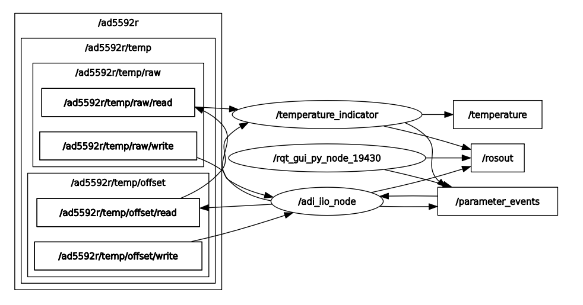
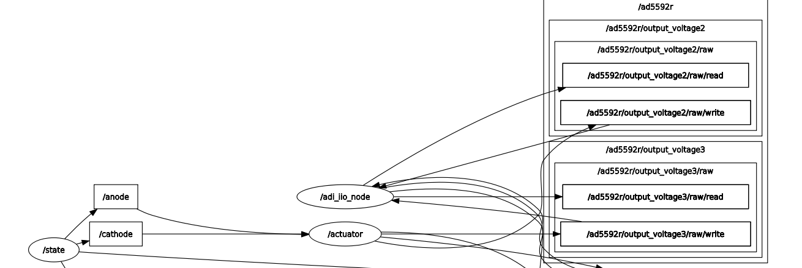

.. _example_ad5592r:

================================================================================
AD5592R
================================================================================

Prerequisites:
================================================================================

* `Raspberry Pi 4B`_ as the remote host with `Kuiper Linux Image`_ installed.
* `AD5592R device tree`_ overlay loaded on the RPi.
* `PMD-RPI-INTZ`_ for HW connections.
* `EVAL-AD5592R-PMDZ`_ as the IIO device.
* A client running ROS2 with the ``adi_iio`` package installed.
* A network connection between the RPi and the client.

The  `EVAL-AD5592R-PMDZ`_ is connected to the RPi via the PMD-RPI-INTZ_ board
using the ``SPI Pmod #1`` connector. The `AD5592R device tree`_ overlay uses
``SPI CS0`` to communicate with the device.

.. warning::

    The ``adi_iio_node`` executable must be running on the client side when
    running the examples.

Examples:
================================================================================

Configuring AD5592R Channel Attributes using ``AttrWriteString`` Service
--------------------------------------------------------------------------------

Configuring a Single Channel Attribute via CLI
^^^^^^^^^^^^^^^^^^^^^^^^^^^^^^^^^^^^^^^^^^^^^^^^^^^^^^^^^^^^^^^^^^^^^^^^^^^^^^^^

You can set a specific attribute of an IIO device channel by calling the
``/adi_iio_node/AttrWriteString`` service. For instance, to set the ``scale``
for ``output_voltage0`` of the ``ad5592r`` device, you would use the following
command:

.. code-block:: shell

    ros2 service call /adi_iio_node/AttrWriteString adi_iio/srv/AttrWriteString "{
        attr_path: 'ad5592r/output_voltage0/scale',
        value: '0.6103515629'
    }"

In this command:
    * ``/adi_iio_node/AttrWriteString`` is the name of the service.
    * ``adi_iio/srv/AttrWriteString`` is the type of the service.
    * ``attr_path: 'ad5592r/output_voltage0/scale'`` specifies the IIO device
      (``ad5592r``), the channel (``output_voltage0``), and the attribute
      (``scale``) to be modified.
    * ``value: '0.6103515629'`` is the new value for the specified attribute.

This approach is useful for quick, individual changes. For initializing a device
with multiple settings or for more complex setups, using a launch file is more
efficient.

Configuring Multiple Channel Attributes via Launch File
^^^^^^^^^^^^^^^^^^^^^^^^^^^^^^^^^^^^^^^^^^^^^^^^^^^^^^^^^^^^^^^^^^^^^^^^^^^^^^^^

The ``ad5592r_config.launch.py`` launch file demonstrates how to set the
``scale`` and ``raw`` attributes for various input and output voltage channels
of the AD5592R device. This is useful for initializing the device to a known state.

The launch file executes a series of ``ros2 service call`` commands to the
``/adi_iio_node/AttrWriteString`` service. For each targeted channel, it sets:
* ``<channel_name>/scale``: Defines the scaling factor for the channel.
* ``<channel_name>/raw``: Sets the raw ADC/DAC value for the channel.

For output channels, both ``scale`` and ``raw`` attributes are set. For input
channels, typically only the ``scale`` attribute is configured via this launch
file.

.. tip:: To run this launch file, execute the following command:

    .. code-block:: shell

        ros2 launch ad5592r ad5592r_config.launch.py

This will configure the following channels on the ``ad5592r`` device:
    * ``output_voltage0``: sets scale and raw attributes.
    * ``input_voltage1``: sets scale attribute.
    * ``input_voltage2``: sets scale attribute.
    * ``output_voltage2``: sets scale and raw attributes.
    * ``input_voltage3``: sets scale attribute.
    * ``output_voltage3``: sets scale and raw attributes.
    * ``input_voltage4``: sets scale attribute.

You can inspect the ``ad5592r_config.launch.py`` file to see the how the
service calls are structured.

Enabling AD5592R Channel Attribute Topics
--------------------------------------------------------------------------------

The ``adi_iio_node`` can publish the values of IIO device attributes to ROS 2
topics. This allows other nodes in the ROS 2 ecosystem to subscribe to and
react to changes in these attribute values.

Enabling a Single Attribute Topic via CLI
^^^^^^^^^^^^^^^^^^^^^^^^^^^^^^^^^^^^^^^^^^^^^^^^^^^^^^^^^^^^^^^^^^^^^^^^^^^^^^^^

To enable publishing for a specific attribute, you can call the
``/adi_iio_node/AttrEnableTopic`` service. For example, to start publishing
the ``raw`` value of ``output_voltage0`` for the ``ad5592r`` device, you would use:

.. code-block:: shell

    ros2 service call /adi_iio_node/AttrEnableTopic adi_iio/srv/AttrEnableTopic "{
        attr_path: 'ad5592r/output_voltage0/raw',
        loop_rate: 1
    }"

This command instructs the ``adi_iio_node`` to create a publisher for the
specified attribute. The topic name will be automatically generated based on
the ``attr_path`` (e.g., ``/ad5592r/output_voltage0/raw``). The node will then
periodically read the attribute and publish its value.

This method is suitable for enabling topics one by one. For enabling multiple
topics at once, a launch file is more convenient.

Enabling Multiple AD5592R Attribute Topics with a Launch File
^^^^^^^^^^^^^^^^^^^^^^^^^^^^^^^^^^^^^^^^^^^^^^^^^^^^^^^^^^^^^^^^^^^^^^^^^^^^^^^^

The ``ad5592r_topics.launch.py`` launch file provides a way to enable topic
publishing for several raw attributes of the AD5592R device simultaneously.

This launch file executes a series of ``ros2 service call`` commands to the
``/adi_iio_node/AttrEnableTopic`` service for various input and output channel
raw attributes.

.. tip:: To run this launch file, execute the following command:

    .. code-block:: shell

        ros2 launch ad5592r ad5592r_topics.launch.py

    By default, this launch file sets the ``loop_rate`` for publishing to 1 Hz.
    You can change the ``loop_rate`` variable in the launch file.

This will enable topics for the following ``raw`` attributes on the ``ad5592r`` device:
    * ``output_voltage0/raw``
    * ``input_voltage1/raw``
    * ``input_voltage2/raw``
    * ``output_voltage2/raw``
    * ``input_voltage3/raw``
    * ``output_voltage3/raw``
    * ``input_voltage4/raw``

After running the launch file, you can list the available topics using
``ros2 topic list``:

.. code-block:: shell

    /ad5592r/input_voltage1/raw/read
    /ad5592r/input_voltage1/raw/write
    /ad5592r/input_voltage2/raw/read
    /ad5592r/input_voltage2/raw/write
    /ad5592r/input_voltage3/raw/read
    /ad5592r/input_voltage3/raw/write
    /ad5592r/input_voltage4/raw/read
    /ad5592r/input_voltage4/raw/write
    /ad5592r/output_voltage0/raw/read
    /ad5592r/output_voltage0/raw/write
    /ad5592r/output_voltage2/raw/read
    /ad5592r/output_voltage2/raw/write
    /ad5592r/output_voltage3/raw/read
    /ad5592r/output_voltage3/raw/write

Since we are dealing with input channels, the ``/read`` topics can be used to
read the current value of the attribute.

.. code-block:: shell

    ros2 topic echo /ad5592r/input_voltage1/raw/read

You can inspect the ``ad5592r_topics.launch.py`` to see how the service calls
are made and how the ``loop_rate`` variable is used.

Transforming Raw Data to Voltage Readings
^^^^^^^^^^^^^^^^^^^^^^^^^^^^^^^^^^^^^^^^^^^^^^^^^^^^^^^^^^^^^^^^^^^^^^^^^^^^^^^^

Once you have topics publishing raw attribute data, you might want to transform
this data into more meaningful units, such as Volts. The ROS 2 ecosystem
provides utility nodes like ``topic_tools transform`` that can subscribe to a
topic, apply a transformation to the messages, and republish them on a new topic.

The ``ad5592r_transforms.launch.py`` launch file demonstrates this by converting
the raw ADC readings from ``input_voltage2`` and ``input_voltage3`` into voltage values.

This launch file uses ``topic_tools transform`` to:
    #. Subscribe to the ``/ad5592r/input_voltage<X>/raw/read`` topics
       (where X is 2 or 3).

    #. Apply a formula: ``volts = (raw_value * scale) / 1000``. In this case,
       the scale is hardcoded to ``0.610351562``, which is a typical scale factor
       for the AD5592R when configured for a 0-2.5V range with its internal
       reference (Vref/4096 = 2.5V/4096). The division by 1000 converts mV to V.
    #. Publish the result as a ``std_msgs/Float64`` message on new topics:
       ``/ad5592r/input_voltage<X>/volts``.

.. tip::

    To use this, you would typically first enable the raw data topics using
    ``ad5592r_topics.launch.py`` as described previously. Then, in a new terminal,
    run the transforms launch file:

    .. code-block:: shell

        ros2 launch ad5592r ad5592r_transforms.launch.py

This will start the transformation nodes. You can then inspect the new topics:

.. code-block:: shell

    ros2 topic echo /ad5592r/input_voltage2/volts

    # Which will output something like this:
    data: 0.000610351562
    ---
    data: 0.000610351562
    ---
    data: 0.000610351562

You can inspect the ``ad5592r_transforms.launch.py`` file to see the exact
commands and transformation expressions used.

Bringing Up the Full AD5592R Example System
--------------------------------------------------------------------------------

To simplify the process of configuring the AD5592R, enabling its data topics,
and setting up data transformations, a top-level bringup launch file is
provided: ``ad5592r_bringup.launch.py``. This file orchestrates the execution
of the previously discussed launch files:

.. tip:: To launch the complete AD5592R example system, execute the
    following command:

    .. code-block:: shell

      ros2 launch ad5592r ad5592r_bringup.launch.py

.. note:: The transform launch file is not included in the bringup process
    because it depends on the topics being active. If the topics are not
    available quickly enough, the transform launch file might fail. It is
    recommended to run the transform launch file separately after ensuring
    that the topics are active.

Creating Custom ROS 2 Nodes for IIO Device Interaction
================================================================================

Beyond using command-line tools and launch files, you can create dedicated ROS2
nodes in Python (or C++) to implement more complex logic involving IIO devices.
These custom nodes can act as clients to the services provided by
``adi_iio_node`` to read, write, or stream IIO attributes and buffer data.

This approach allows for tailored applications, such as:

* Implementing control loops based on sensor readings.
* Performing advanced data processing and fusion.
* Integrating IIO device data with other ROS 2 capabilities (e.g., navigation,
  manipulation).

The following examples demonstrates how to create a custom ROS2 node for
different applications:

Temperature Indicator Node
--------------------------------------------------------------------------------

The ``temperature_indicator.py`` script provides an example of a ROS 2 node that
reads the AD5592R's internal temperature sensor attributes, calculates the
temperature in Celsius, and publishes it on a ROS 2 topic.

**Purpose:** The ``TemperatureIndicator`` node demonstrates how to:

* Create service clients to interact with ``adi_iio_node``.
* Read IIO attributes (``scale``, ``offset``, ``raw``) for the temperature
   sensor channel (``temp``) of the ``ad5592r`` device.
* Enable topic publishing for specific IIO attributes (``raw`` and
   ``offset``) via service calls.
* Subscribe to these newly enabled topics to get periodic updates.
* Perform calculations using the retrieved attribute values.
* Publish the processed data (temperature in Celsius with running mean and
   variance) on a standard ``sensor_msgs/msg/Temperature`` topic.

**Services Showcased:** This node primarily utilizes the following services
from ``adi_iio_node``:

* ``adi_iio/srv/AttrReadString``: To read the ``scale`` attribute of the
  temperature sensor once at startup.
* ``adi_iio/srv/AttrEnableTopic``: To request ``adi_iio_node`` to start
  publishing the ``raw`` and ``offset`` attributes of the temperature sensor
  to dedicated topics.

**How to Run and Inspect:**

#. **Run the Node**:

    You can run the node using ``ros2 run``:

    .. code-block:: shell

        ros2 run ad5592r temperature_indicator

    You can also pass parameters, for example, to change the update rate:

    .. code-block:: shell

        ros2 run ad5592r temperature_indicator --ros-args -p timer_period:=0.5

#. **Inspect its Behavior**:

    * **Node List**: Check if the node is running:

    .. code-block:: shell

        ros2 node list

    * **Topic List**: See the topics it interacts with:

    .. code-block:: shell

        ros2 topic list
        # You should see /temperature, /ad5592r/temp/raw/read, /ad5592r/temp/offset/read, etc.

    * **Echo Temperature Data**: View the published temperature:

    .. code-block:: shell

        ros2 topic echo /temperature

        # Should return:
        # header:
        # stamp:
        #    sec: 1747036204
        #    nanosec: 922183048
        # frame_id: ''
        # temperature: 26.089715531578957
        # variance: 0.12639853924376374

    * **Node Info**: Get detailed information about its subscriptions, publications, and services:

    .. code-block:: shell

        ros2 node info /temperature_indicator

**Communication Flow:**

#. **Initialization**:

    * The node declares parameters for timer period, the ``adi_iio_node``
        service provider name, and QoS settings.
    * It creates service clients for ``AttrReadString`` and ``AttrEnableTopic``.
    * It waits for these services to become available.

#. **Attribute Reading & Topic Enabling**:

    * It makes an asynchronous service call to ``AttrReadString`` to fetch
        the ``ad5592r/temp/scale`` value.
    * It makes asynchronous service calls to ``AttrEnableTopic`` for
        ``ad5592r/temp/raw`` and ``ad5592r/temp/offset``. This tells
        ``adi_iio_node`` to start publishing these values.

#. **Data Subscription**:

    * The node subscribes to ``ad5592r/temp/raw/read`` and
        ``ad5592r/temp/offset/read`` topics (which are of type
        ``std_msgs/msg/String`` as enabled by ``AttrEnableTopic``).

#. **Periodic Processing & Publishing**:

    * A timer periodically triggers a callback.
    * Inside the timer callback, if ``raw`` and ``offset`` values have been
      received from the subscriptions, the node:

        * Computes the temperature using the formula:
          `temp_degC = ((raw + offset) * scale) / 1000`.
        * Updates a running mean and variance of the temperature.
        * Publishes a ``sensor_msgs/msg/Temperature`` message containing the
          current mean temperature and variance to the ``/temperature`` topic.

Actuator and State Machine Example: Controlling Output Channels
--------------------------------------------------------------------------------

This example demonstrates a more complex interaction involving two custom ROS 2 nodes:

#. ``actuator.py``: A node that subscribes to voltage commands on ROS 2 topics
   and translates them into raw values to control output channels of the
   AD5592R (e.g., to drive an LED).
#. ``state_machine.py``: A node that generates various voltage signal patterns
   and publishes them to the topics the ``actuator.py`` node listens to.

Together, these nodes showcase how one can create a system where high-level
commands (generated by the state machine) are translated into low-level hardware
control (by the actuator) via the ``adi_iio_node``.

**1. Actuator Node**

The ``actuator.py`` script acts as an interface to control specific output
channels of the AD5592R.

**Purpose:** The ``Actuator`` node demonstrates how to:

* Declare parameters for IIO attribute paths (e.g., for anode and cathode raw
  and scale attributes) and topic names.
* Create service clients for ``AttrReadString``, ``AttrEnableTopic``, and
  ``AttrDisableTopic``.
* Use ``AttrReadString`` to fetch the ``scale`` values for the configured output
  channels. This is crucial for converting desired voltage levels into raw DAC values.
* Use ``AttrEnableTopic`` to instruct ``adi_iio_node`` to create
  ``<attr_path>/write`` topics. This allows the ``Actuator`` to send raw values
  to the AD5592R by publishing to these specific topics.
* Subscribe to user-defined topics (e.g., ``/anode``, ``/cathode``) that carry
  desired voltage levels (as ``std_msgs/msg/Float64``).
* In the subscription callback, convert the received voltage (e.g., 0-2.5V) into
  a raw integer value (e.g., 0-4095) using the previously read ``scale``.
* Publish the calculated raw value as a ``std_msgs/msg/String`` to the
  corresponding ``.../raw/write`` topic (e.g., ``/ad5592r/output_voltage2/raw/write``).
* Use ``AttrDisableTopic`` during node shutdown to clean up the topics enabled
  in ``adi_iio_node``.

**Services & Topics Utilized by Actuator:**

* **Service Clients:**

    * ``adi_iio/srv/AttrReadString``: To get ``scale`` values for
      ``output_voltageX/scale``.
    * ``adi_iio/srv/AttrEnableTopic``: To enable ``adi_iio_node`` to expose
      ``output_voltageX/raw/write`` topics.
    * ``adi_iio/srv/AttrDisableTopic``: To disable the topics upon shutdown.

* **Subscribers:**

    * topics like ``/anode`` and ``/cathode`` (configurable via parameters,
      type ``std_msgs/msg/Float64``) for receiving voltage commands.

* **Publishers:**

    * To topics like ``/ad5592r/output_voltage2/raw/write`` and
      ``/ad5592r/output_voltage3/raw/write`` (configurable via parameters,
      type ``std_msgs/msg/String``) to send raw values to ``adi_iio_node``.

**2. State Machine Node**

The ``state_machine.py`` script generates time-varying voltage signals.

**Purpose:** The ``StateMachine`` node demonstrates how to:

* Define a sequence of states (e.g., "ANODE_RISING", "ANODE_FALLING",
  "CATHODE_RISING", "CATHODE_FALLING").
* Generate a signal (e.g., a linear ramp from 0V to 2.5V).
* In each state, publish this signal to a specific topic (``/anode`` or
  ``/cathode``, configurable via parameters).

**Topics Utilized by StateMachine:**

* **Publishers:** To topics like ``/anode`` and ``/cathode`` (configurable
  via parameters, type ``std_msgs/msg/Float64``) to send generated voltage signals.

**How to Run and Inspect:**

#. **Run the Nodes**:

    * Open two separate terminals.
    * In the first terminal, run the Actuator node. You might want to specify
      which AD5592R channels are connected to your "anode" and "cathode" if they
      differ from the defaults (``output_voltage2`` and ``output_voltage3`` respectively).

    .. code-block:: shell

        ros2 run ad5592r actuator

        # Example with custom channels:
        ros2 run ad5592r actuator --ros-args \
            -p anode_raw:="ad5592r/output_voltage0/raw" \
            -p anode_scale:="ad5592r/output_voltage0/scale" \
            -p cathode_raw:="ad5592r/output_voltage2/raw" \
            -p cathode_scale:="ad5592r/output_voltage2/scale"

    .. tip:: With the ``actuator`` node running, you can publish data to one of
        the topics which will be converted to a raw value and sent to the
        channel. For example:

        .. code-block:: shell

            ros2 topic pub --once /cathode std_msgs/msg/Float64 "data: 2.5"
            ros2 topic pub --once /anode std_msgs/msg/Float64 "data: 0"

    * In the second terminal, run the StateMachine node. You can adjust the
      `state_period` to control how long one full cycle of all states takes.

    .. code-block:: shell

        ros2 run ad5592r state_machine --ros-args -p state_period:=4.0

#. **Inspect its Behavior**:

    * **Node List**:

    .. code-block:: shell

        ros2 node list
        # You should see /actuator and /state

    * **Topic List & Echo**: Observe the topics used for communication.

    .. code-block:: shell

        ros2 topic list
        # You should see /anode, /cathode, /ad5592r/output_voltageX/raw/write, etc.

        ros2 topic echo /anode
        # See the voltage commands from the StateMachine

        ros2 topic echo /ad5592r/output_voltage2/raw/write # Or your configured anode raw write topic
        # See the raw string values sent by the Actuator to adi_iio_node

    * **Node Info**:

    .. code-block:: shell

        ros2 node info /actuator
        ros2 node info /state

    * **Hardware Observation**: If you have an LED or oscilloscope connected
      to the AD5592R output channels being controlled, you should see its
      behavior change according to the patterns generated by the ``StateMachine``.

**Combined Operation & Communication Flow:**

#. **Initialization:**

    * The ``Actuator`` node starts, reads the ``scale`` for its configured output
      channels (e.g., ``output_voltage2`` and ``output_voltage3``) from
      ``adi_iio_node`` using ``AttrReadString``.
    * The ``Actuator`` then requests ``adi_iio_node`` (via ``AttrEnableTopic``)
      to allow writing to the ``raw`` attributes of these channels by publishing
      to topics like ``/ad5592r/output_voltage2/raw/write``.
    * The ``Actuator`` subscribes to ``/anode`` and ``/cathode`` topics for
      voltage commands.
    * The ``StateMachine`` node starts and prepares to publish to ``/anode``
      and ``/cathode``.

#. **Voltage Command Reception & Actuation (Actuator):**

    * The ``Actuator`` receives the voltage value on its ``/anode`` subscription.
    * It converts this voltage to a raw DAC value.
    * It publishes this raw value as a string to ``/ad5592r/output_voltage2/raw/write``.

#. **Hardware Update (adi_iio_node):**

    * ``adi_iio_node`` receives the string on ``/ad5592r/output_voltage2/raw/write``,
      and writes it to the actual IIO device's ``raw`` attribute for ``output_voltage2``.
      If an LED is connected to this channel, its brightness would change.

This example illustrates a decoupled system where one node is responsible for
high-level behavior generation and another for low-level hardware interfacing,
communicating via standard ROS 2 topics and services.

.. _Kuiper Linux Image: https://www.analog.com/en/resources/evaluation-hardware-and-software/software/kuiper-linux.html
.. _Raspberry Pi 4B: https://www.raspberrypi.com/products/raspberry-pi-4-model-b/
.. _PMD-RPI-INTZ: https://www.analog.com/en/resources/evaluation-hardware-and-software/evaluation-boards-kits/pmd-rpi-intz.html#eb-overview
.. _EVAL-AD5592R-PMDZ: https://www.analog.com/en/resources/evaluation-hardware-and-software/evaluation-boards-kits/eval-ad5592r-pmdz.html
.. _AD5592R device tree: https://github.com/adisuciu/m2kirl/blob/main/dt/rpi-ad5592r-m2kirl.dts
