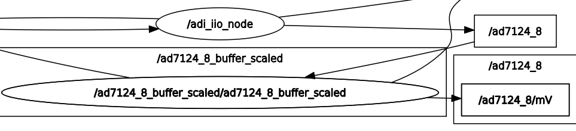
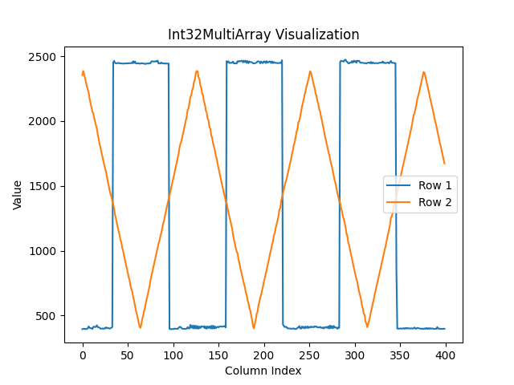

.. _example_ad7124-8:

================================================================================
AD7124-8
================================================================================

Prerequisites:
================================================================================

* `Raspberry Pi 4B`_ as the remote host with `Kuiper Linux Image`_ installed.
* `AD7124 device tree`_ overlay loaded on the RPi.
* `PMD-RPI-INTZ`_ for HW connections.
* `EVAL-AD7124-8-PMDZ`_ as the IIO device.
* A client running ROS2 with the ``adi_iio`` package installed.
* A network connection between the RPi and the client.

The  `EVAL-AD7124-8-PMDZ`_ is connected to the RPi via the PMD-RPI-INTZ_ board
using the ``SPI Pmod #2`` connector. The `AD7124 device tree`_ overlay uses
``SPI CS1`` to communicate with the device.

.. warning::

    The ``adi_iio_node`` executable must be running on the client side when
    running the examples.

Examples:
================================================================================

Configuring AD7124-8 Channel Attributes using ``AttrWriteString`` Service
--------------------------------------------------------------------------------

Configuring a Single Channel Attribute via CLI
^^^^^^^^^^^^^^^^^^^^^^^^^^^^^^^^^^^^^^^^^^^^^^^^^^^^^^^^^^^^^^^^^^^^^^^^^^^^^^^^

You can set a specific attribute of an IIO device channel by calling the
``/adi_iio_node/AttrWriteString`` service. For instance, to set the ``scale``
for ``input_voltage0-voltage1`` of the ``ad7124-8`` device, you would use the following
command:

.. code-block:: shell

    ros2 service call /adi_iio_node/AttrWriteString adi_iio/srv/AttrWriteString "{
        attr_path: 'ad7124-8/input_voltage0-voltage1/scale',
        value: '0.000149011'
    }"

In this command:

* ``/adi_iio_node/AttrWriteString`` is the name of the service.
* ``adi_iio/srv/AttrWriteString`` is the type of the service.
* ``attr_path: 'ad7124-8/input_voltage0-voltage1/scale'`` specifies the IIO device
  (``ad7124-8``), the channel (``input_voltage0-voltage1``), and the attribute
  (``scale``) to be modified.
* ``value: '0.000149011'`` is the new value for the specified attribute.

This approach is useful for quick, individual changes. However, for initializing
a device with multiple settings or for more complex setups, using a launch file
is more efficient.

Configuring Multiple Channel Attributes via Launch File
^^^^^^^^^^^^^^^^^^^^^^^^^^^^^^^^^^^^^^^^^^^^^^^^^^^^^^^^^^^^^^^^^^^^^^^^^^^^^^^^

The ``ad7124_8_config.launch.py`` demonstrates how to set the ``scale`` and
``sampling_frequency`` attributes for all 8 differential input voltage channels
of the AD7124-8 device. This is particularly useful for initializing the device
with consistent settings across all its channels.

The launch file achieves this by executing a series of ``ros2 service call``
commands to the ``/adi_iio_node/AttrWriteString`` service. For each targeted
differential channel of the ``ad7124-8`` device, it sets:

* ``<channel_path>/scale``: Defines the scaling factor (e.g., Volts per LSB)
  for the channel.
* ``<channel_path>/sampling_frequency``: Sets the desired sampling rate for
  the channel.

.. tip:: To run this launch file, execute the following command in your terminal:

    .. code-block:: shell

      ros2 launch ad7124_8 ad7124_8_config.launch.py

    Ensure that the ``adi_iio_node`` is running and can access an IIO device
    named ``ad7124-8``.

This launch file will configure the ``scale`` and ``sampling_frequency`` for the
following differential channels on the ``ad7124-8`` device:

* ``input_voltage0-voltage1``
* ``input_voltage2-voltage3``
* ``input_voltage4-voltage5``
* ``input_voltage6-voltage7``
* ``input_voltage8-voltage9``
* ``input_voltage10-voltage11``
* ``input_voltage12-voltage13``
* ``input_voltage14-voltage15``

You can inspect the ``ad7124_8_config.launch.py`` file to understand how the
service calls are constructed for each channel.

Enabling AD7124-8 Channel Attribute Topics
--------------------------------------------------------------------------------

Similar to other IIO devices, the ``adi_iio_node`` can publish the values of
AD7124-8 attributes to ROS 2 topics. This allows other ROS 2 nodes to subscribe
to these topics and receive real-time updates of attribute values, such as raw
ADC readings from its differential channels.

Enabling a Single Attribute Topic via CLI
^^^^^^^^^^^^^^^^^^^^^^^^^^^^^^^^^^^^^^^^^^^^^^^^^^^^^^^^^^^^^^^^^^^^^^^^^^^^^^^^

To enable topic publishing for a specific attribute of the AD7124-8, you can
call the ``/adi_iio_node/AttrEnableTopic`` service. For instance, to start
publishing the ``raw`` value of the ``input_voltage0-voltage1`` differential
channel of the ``ad7124-8`` device, you would use the following command:

.. code-block:: shell

    ros2 service call /adi_iio_node/AttrEnableTopic adi_iio/srv/AttrEnableTopic "{
        attr_path: 'ad7124-8/input_voltage0-voltage1/raw',
        loop_rate: 1
    }"

This command instructs the ``adi_iio_node`` to create a publisher for the
specified attribute. The topic name will be automatically generated based on the
``attr_path`` (e.g., ``/ad7124-8/input_voltage0-voltage1/raw/read`` for readable
attributes). The node will then periodically read the attribute and publish its
value.

While this method is useful for enabling individual topics, a launch file is
more convenient for enabling topics for multiple attributes or channels at once.

Enabling Multiple AD7124-8 Attribute Topics with a Launch File
^^^^^^^^^^^^^^^^^^^^^^^^^^^^^^^^^^^^^^^^^^^^^^^^^^^^^^^^^^^^^^^^^^^^^^^^^^^^^^^^

The ``ad7124_8_topics.launch.py`` launch file provides a convenient way to
enable topic publishing for the ``raw`` attributes of several differential
input channels of the AD7124-8 device simultaneously.

This launch file executes a series of ``ros2 service call`` commands to the
``/adi_iio_node/AttrEnableTopic`` service for each specified channel's ``raw``
attribute.

.. tip:: To run this launch file, ensure the ``adi_iio_node`` is running and
    connected to your AD7124-8 device. Then, execute the following command:

    .. code-block:: shell

      ros2 launch ad7124_8 ad7124_8_topics.launch.py

    By default, this launch file sets the ``loop_rate`` for publishing to 1 Hz.
    You can change the ``loop_rate`` variable in the launch file.

This will enable topics for the ``raw`` attributes of the following differential
channels on the ``ad7124-8`` device:

* ``input_voltage0-voltage1/raw``
* ``input_voltage2-voltage3/raw``

After running the launch file, you can list the available topics using
``ros2 topic list``:

.. code-block:: shell

  /ad7124_8/input_voltage0_voltage1/raw/read
  /ad7124_8/input_voltage0_voltage1/raw/write
  /ad7124_8/input_voltage2_voltage3/raw/read
  /ad7124_8/input_voltage2_voltage3/raw/write

Since these are input channels, the ``/read`` suffixed topics can be used to
echo the current raw ADC values:

.. code-block:: shell

  ros2 topic echo /ad7124_8/input_voltage0_voltage1/raw/read

You can inspect the ``ad7124_8_topics.launch.py`` file to see exactly which
channels' topics are enabled, how the service calls are structured, and how the
``loop_rate`` variable is used.

Transforming Raw AD7124-8 Data to Voltage Readings
--------------------------------------------------------------------------------

Once you have topics publishing raw ADC data from the AD7124-8, you will likely
want to convert this raw integer data into meaningful voltage units. The ROS 2
ecosystem provides utility nodes like ``topic_tools transform`` that can
subscribe to a topic, apply a mathematical transformation to the messages, and
republish the results on a new topic.

The ``ad7124_8_transforms.launch.py`` launch file demonstrates this process.
It converts the raw ADC readings from the ``input_voltage0_voltage1`` and
``input_voltage2_voltage3`` differential channels of the AD7124-8 into voltage
values.

This launch file uses the ``topic_tools transform`` utility to:

#. Subscribe to the raw data topics, e.g., ``/ad7124-8/input_voltage0_voltage1/raw/read``.

#. Apply a formula to convert the raw data (``m.data``) to Volts.

#. Publish the calculated voltage as a ``std_msgs/Float64`` message on new
   topics, e.g., ``/ad7124-8/input_voltage0_voltage1/volts``.

.. tip:: To use this transformation, you would typically first enable the raw
    data topics using the ``ad7124_8_topics.launch.py`` file as described
    previously. Then, in a new terminal, run the transforms launch file:

    .. code-block:: shell

      ros2 launch ad7124_8 ad7124_8_transforms.launch.py

This will start the transformation nodes. You can then inspect the new topics:

.. code-block:: shell

    ros2 topic list

To see the transformed voltage readings for the first differential channel,
for example:

.. code-block:: shell

    ros2 topic echo /ad7124_8/input_voltage0_voltage1/volts

You can inspect the ``ad7124_8_transforms.launch.py`` file to see the exact
commands and transformation expressions used.

Bringing Up the Full AD7124-8 Example System
--------------------------------------------------------------------------------

To simplify the process of configuring the AD7124-8, enabling its data topics,
and setting up data transformations, a top-level bringup launch file is
provided: ``ad7124_8_bringup.launch.py``. This file orchestrates the execution
of the previously discussed launch files:

.. tip:: To launch the complete AD7124-8 example system, execute the
    following command:

    .. code-block:: shell

      ros2 launch ad7124_8 ad7124_8_bringup.launch.py

.. note:: The transform launch file is not included in the bringup process
    because it depends on the topics being active. If the topics are not
    available quickly enough, the transform launch file might fail. It is
    recommended to run the transform launch file separately after ensuring
    that the topics are active.

Creating Custom ROS 2 Nodes for IIO Device Interaction
================================================================================

The following example demonstrates a Python-based ROS 2 node that monitors data
from an AD7124-8 channel using buffered reads which can be accessed via
a topic.

Example: ``ad7124_8_buffer_scaled.py``
--------------------------------------------------------------------------------

Usage:
^^^^^^^^^^^^^^^^^^^^^^^^^^^^^^^^^^^^^^^^^^^^^^^^^^^^^^^^^^^^^^^^^^^^^^^^^^^^^^^^

To run the example, execute the following command in your terminal:

.. code-block:: shell

    ros2 launch ad7124_8 ad7124_8_buffer_scaled.launch.py

When you execute the command, the ROS2 launch system will start the
``adi_iio`` node and the ``ad7124_8_buffer_scaled`` node example.

#.  **adi_iio_node**:

    *   **Package**: ``adi_iio``
    *   **Executable**: ``adi_iio_node``
    *   **Purpose**: Acts as a bridge to the Linux Industrial I/O (IIO)
        subsystem, enabling communication with connected hardware sensors.
    *   **Key Parameters**:

        * ``uri: "ip:10.76.84.244"``: Configures the node to use a remote IIO
          Network context where the target HW is connected.

#.  **ad7124_8_buffer_scaled**:

    *   **Package**: ``ad7124_8``
    *   **Executable**: ``ad7124_8_buffer_scaled``
    *   **Purpose**:

        It relies on the
        ``adi_iio_node`` to access these hardware attributes.
    *   **Key Parameters**:

        *   ``device_path``: specifies the IIO device path.
        *   ``channels``: specifies the channels to be monitored.
        *   ``sampling_frequency``:  channel attribute which is
            used to set the sampling frequency for the channels.
        *   ``scale``: channel attribute which is used to set the scale for the
            channels.
        *   ``samples_count``: the number of samples to be read from each
            channel.
        *   ``loop_rate: 1``: the operational loop frequency for the scaled
            output topic.
        *   ``topic_name``: the name of the topic containing raw buffer data.

Service Clients:
^^^^^^^^^^^^^^^^^^^^^^^^^^^^^^^^^^^^^^^^^^^^^^^^^^^^^^^^^^^^^^^^^^^^^^^^^^^^^^^^

- **AttrReadString**: used to store ``scale`` factor for each channel in the
  buffered reading.

- **AttrWriteString**: used to bring ``sampling_frequency`` and ``scale``
  attributes to predefined values.

- **BufferCreate**: used to create a buffer for the specified device which will
  monitor the specified channels.

- **BufferDestroy**: used during cleanup to free HW resources.

- **BufferDisableTopic**: used during cleanup to disable the topic
  publishing.

- **BufferEnableTopic**: used to enable the topic publishing of raw data for
  the buffered operations.

Topics:
^^^^^^^^^^^^^^^^^^^^^^^^^^^^^^^^^^^^^^^^^^^^^^^^^^^^^^^^^^^^^^^^^^^^^^^^^^^^^^^^

    AD7124-8 Buffer Scaled Node Graph

- ``/ad7124_8 [std_msgs/msg/Int32MultiArray]``:  this topic contains the
  buffered data from the specified channels. The data is published in a
  multi-array format, where each element corresponds to a channel's reading.
  Each sample is represented in **raw** format.

- ``/ad7124_8/mV [std_msgs/msg/Int32MultiArray]``: this topic contains the
  scaled transformation from raw to millivolts applied by the
  ``ad7124_8_buffer_scaled`` node to the buffered data published in the ``/ad7124_8``
  topic.

.. _demo_ad7124_8_visualize_waveform:

Demo AD7124-8 Visualize Waveform:
^^^^^^^^^^^^^^^^^^^^^^^^^^^^^^^^^^^^^^^^^^^^^^^^^^^^^^^^^^^^^^^^^^^^^^^^^^^^^^^^

The data from topics ``/ad7124_8`` and ``/ad7124_8/mV`` can be visualized using
the visualize_iio_waveform.py.

First you need to launch the example:

.. code-block:: shell

    ros2 launch ad7124_8 ad7124_8_buffer_scaled.launch.py

Then within the ``iio_ros2`` repository, enter the ``launch`` folder and run
the following command:

.. code-block:: shell

    python3 visualize_iio_waveform.py --topic /ad7124_8/mV

This will output the scaled data from the ``/ad7124_8/mV`` topic as shown in
the figure below. Note that the data is in millivolts and the launch file
was configured to capture buffers of ``400 samples`` from channels:
``input_voltage0-voltage1,input_voltage2-voltage3``.
Channel ``AIN0`` is connected to channel ``W1`` of an M2K device which outputs
a square wave signal. The channel ``AIN2`` is connected to channel ``W2`` which
outputs a triangle wave. Both waveforms are generated with ``1.25V`` offset,
``1V`` amplitude and ``1Hz`` frequency. Both ``AIN1`` and ``AIN3`` are
connected to GND.

    AD7124-8 Buffer Scaled Plot

.. note:: You can also visualize the raw data from the ``/ad7124_8`` topic by
    which is created by the combination of the ``BufferCreate`` and
    ``BufferEnableTopic`` services.

    ..  code-block:: shell

        python3 visualize_iio_waveform.py --topic /ad7124_8

.. _Kuiper Linux Image: https://www.analog.com/en/resources/evaluation-hardware-and-software/software/kuiper-linux.html
.. _Raspberry Pi 4B: https://www.raspberrypi.com/products/raspberry-pi-4-model-b/
.. _PMD-RPI-INTZ: https://www.analog.com/en/resources/evaluation-hardware-and-software/evaluation-boards-kits/pmd-rpi-intz.html#eb-overview
.. _EVAL-AD7124-8-PMDZ: https://www.analog.com/en/resources/evaluation-hardware-and-software/evaluation-boards-kits/eval-ad7124-8-pmdz.html
.. _AD7124 device tree: https://gist.github.com/Adrian-Stanea/ce950054ed865d66e3c1eee02a712a34
